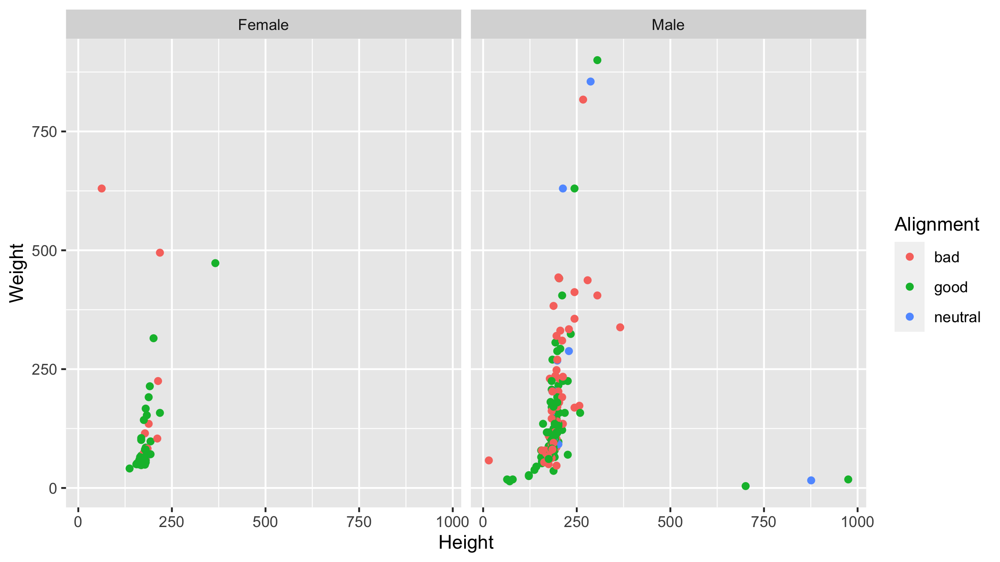

```{r setup, include=FALSE}
knitr::opts_chunk$set(echo = TRUE)
library(knitr)
library(dplyr)
library(ggplot2)
library(here)
library(sjPlot)
```

## Basic Project Workflow

There is no single right way to keep an organized and reproducible project directory. This is just one set of recommendations of a strategy that works for us and is at least a good starting place. 

1. Make a clear plan for what will constitute a distinct 'project' and what data are needed for that project. It's easy to jump right into data analysis, but it really saves time down the road to have all the raw data organized first. Which data tables will be needed and which columns will each table need to have? Adding more data later is of course possible and sometimes unavoidable, but it can make it hard to stay organized! 

2. Put together those data sets. For tree swallow data, this will likely involve compiling some data from different places and from the database. In an ideal world, this data would be as 'raw' as possible, but our 'raw' form data is often already summarized to some extent (e.g., feeding rates from rfids rather than all the raw rfid files). Save these raw data files as tab delimited text or comma separated value files. **Make sure your data are tidy!!** If you aren't sure what that means you can find lots of guides to tidy data online.

3. Go to your GitHub account and make a new repository. Give it a descriptive name that is not too long. You can also use this repository as a template to start your new project by either forking it or by clicking the 'template' button that will start a new repository with it's own name but keep all the structure and files associated with this repository, then you can edit as needed for your new project. If you use this as a template, several of the steps listed below will already be done for you.

4. Go to your repository. Click the green 'code' button and copy the link to clone the https repository. [Note that the first time you are setting GitHub & RStudio on your computer there may be some extra steps. See links to getting started below.]

5. Open RStudio, choose to start a new project. Choose 'version control' and 'Git'. Put in the url you copied from your repository. Choose a folder for your project to live in on your local machine and give the project directory a name (using the repo name works fine!). 

6. Now the project is on your machine and you can start making changes before pusing them back up to GitHub! Before starting analysis, I'd recommend making the following folder structure as a general rule (of course different projects might have different requirements). In this template project, all of these folders have been made already. 

* **0_manuscript**: Store word/text documents when you start writing the manuscript. 
* **1_raw_data**: Store your starting raw data. Never modify this folder contents in code.
* **2_modified_data**: Store new data objects created by your code if needed.
* **3_r_scripts**: Store R scripts and R Markdown code
* **4_output_figures**: Store any figure outputs that you want to save as individual files.
* **5_other_outputs**: Store things like tables or more complicated outputs. 
* **9_supporting_files**: Store older files (e.g., an excel file used to make your starting data).
* **README.md**: Created by GitHub. Text file created by GitHub. Good place to use as a 'lab notebook'.
* **Project**: The R project. All your code will use relative path names to the folders above. 

7. Open the project and make a new R script and a new markdown document. Save them into the '3_r_scripts'
directory. Give them short, meaningful names. If you will have multiple scripts that need to be run in order, starting the file names with numbers will keep them all in order. For all of your files, think hard about using a consistent, logical naming scheme. Breaking up your code into different shorter scripts (e.g. cleaning/preprocessing, modeling, complicated plots etc.) can be helpful if you find yourself getting lost in your code. 

8. Start your coding and analysis! As you create or read objects, store them into the appropriate folders above. For more complicated analysis you might have subfolders within some of the above or additional folders not listed here.

9. Using the 'Git' panel in RStudio. You can commit your changes and push them back up to GitHub (with a note about what you changed). It's also good practice to 'Pull' your project down from GitHub each time you start a new session to make sure you have the up to date version (this is most important if you are collaborating with other people who might have made changes between your sessions, if you forget in your own session it's usually no big deal). You can commit your changes as often as you like. Maybe each time you finish a session working in R, or each time you are about to delete or modify a different section. Each time you commit will be a point that you can return to using version control on Git if you need to go back to that point later.

10. As a general rule, we often write out code first in an organized and well annotated R script, and then migrate the right chunks of that code into a Markdown dowcument that puts together explanation, code, figures, and interpretation into a nice output format. There are a bunch of suggestions for organizing the code itself in the R script included here. 

11. The goal for following this workflow is all of the parts that go into a project (paper) are stored together in a single folder (repository) that is complete and sufficient to reproduce everything. This should make it a lot easier to upload data and code when a paper is accepted and to share contents with other people.

## Creating a Markdown File

The big benefit of Markdown as opposed to just using R scripts is that it is much easier to intersperse text, code, and output in a way that is readable. That makes it great for summarizing your project in a way that is good for sharing with collaborators (or your future self). The code does run slower than through a script though and if you are writing long scripts it can be a bit more of a pain to organize the R scripts into chunks for markdown. For that reason it's often easiest to have both or to work first in an r script with notes and relevant sections saved and summarized in Markdown. You can still organize the code in a similar way (loading packages and data in the first chunks, etc) as suggested in the R script template in this repository. 

### Markdown Styles

You can customize the output of Markdown in a lot of different ways using the header at the top and commands for each code chunk (html or pdf, table of contents, colors, etc). The settings above give a nice html template with code folding (visible but only on a click) and a floating table of contents, but there are lots of guides showing how to change these things. You can even include citations and use reference managers to ultimately export into word. Because you can embed code within paragraphs, it would be possible to create an entire reproducible *manuscript* in Markdown that would automatically update as you change numbers in tables etc (though that might be a goal for down the road!).

Here is how you embed a new figure created in Markdown. I'm installing the Palmer Penguins package to plot with. This package has been suggested as a good alternative to the `iris` dataset that is often used in R tutorials because of RA Fisher's association with that dataset and with horribly racist eugenics...plus penguins are cooler than flowers.

```{r cars, warning = FALSE, message = FALSE}
# Create a simple plot in markdown
  #install.packages("palmerpenguins")
  library(palmerpenguins)
  penguins <- palmerpenguins::penguins
  ggplot(penguins, aes( x = bill_length_mm, y = bill_depth_mm)) +
    geom_point(aes (color = species)) + 
    scale_color_manual(values = c("darkorange", "darkorchid", "cyan4")) + theme_classic()
```

You can of course do a huge amount of customization of the plotting appearance and labels, but that is the subject for a different tutorial.

### Saved Figures in Markdown

You can also include figures or tables generated in a script in your Markdown summary file by referencing the saved file in your project directory like this (assuming the png/jpg/tiff is saved in the same directory as your markdown script):

\

That figure was made in the example '1_main_script.R' that goes along with this repository. This could be useful if you run some analyses that take a long time in your R script and want to include just the output figure or table in your markdown summary. You can also display figures from a code chunk. With most of these things in R there are many different ways to do the same things and if you figure out a technique that works well go ahead and use it!

### Saved Tables in Markdown

You can also produce nice tables in Markdown. There are various different ways to do this, but one example given here is to save your table using the `tab_model` function from `sjPlot` and then just load the table directly into markdown. This method works really well for linear models (but doesn't work if you want to output your markdown file as a pdf). You could also do the table construction directly in markdown if that makes more sense for your project.

```{r}
m <- readRDS(here::here("5_other_outputs/hero_table.rds"))
m
```


### Coding Style

Pick a consistent coding and annotation style and stick with it!! Try to be disciplined. It will make it much easier for you and collaborators to read your code. Think about things like snake_case or ~~CamelCase~~ (edit by Sabrina: 
snake_case is Style Guide Approved; edit by Conor: I *used* to use CamelCase and `.` a lot as a separator in names, but I agree snake_case with underscores is easier to read and I always avoid `.` now too, but the most important thing is being consistent, when you switch back and forth between capitals and lowercase it can really slow you down trying to remember your object and column names), indentations and spaces, object names, etc. See the link below to the tidyverse style guide.

## Useful Resources

The internet is full of resources for learning about R and a lot are very specific. This is a very incomplete list of resources that we can add to for things we found particularly helpful in getting set up. These links are focused on how to get started and keep your projects organized and reproducible and not on using code or packages for specific purposes (since that is a huge topic!).

### Github & RStudio

https://happygitwithr.com/

### R Markdown

https://rstudio.com/wp-content/uploads/2015/02/rmarkdown-cheatsheet.pdf

### Project Oriented Workflow

https://www.tidyverse.org/blog/2017/12/workflow-vs-script/

### Coding Style and Annotation

https://style.tidyverse.org/index.html

### Tidy Data and R For Data Science (R4DS)

> "Happy families are all alike; every unhappy family is unhappy in its own way." - Leo Tolstoy 

> "Tidy datasets are all alike, but every messy dataset is messy in its own way." - Hadley Wickham

The R4DS free book is a great resource for many of the issues discussed here, but definitely spend some time understanding the tidy data chapter. Keeping data tidy makes it very easy to move to longer or wider formats using `pivot_longer` or `pivot_wider` without having to resort to any kind of manual editing or copy pasting in excel. Ideally your analysis starts with a small number of tidy data frames and all subsequent steps are coded to proceed from those original data with no manual modifications or selections.

https://r4ds.had.co.nz/tidy-data.html

### How to Name your Files
The names of your files should be 
1. Machine readable 
2. Human readable 
2. Sortable 

For more information please see: 
https://speakerdeck.com/jennybc/how-to-name-files

## Ending your document

I've started to try to always end my R Markdown summaries by printing the session info for your R environment. That way the versions of all of your packages and the list of any you have loaded will be preserved with the output. The goal is that with this info someone else should be able to take your entire directory of folders, configure their R session with the right packages (annoying but possible) and then reproduce everything exactly as you have it in your final version on their own computer without the need for any additional files and all using relative path names.

```{r}
sessionInfo()
```

